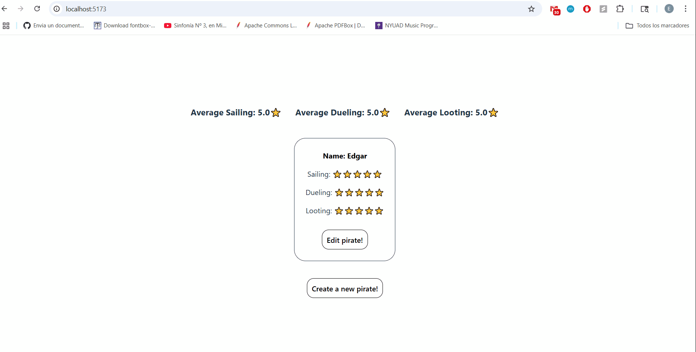

# WEB102 Project 7 - Pirate Gang

Submitted by: **Edgar Palomino**

**Pirate Gang** is a website where pirate aficionados can make their own pirate crew to sail the seven seas.

Time spent: **5** hours spent in total

## Required Features

The following **required** functionality is completed:

* [X] The web app contains a page that features a create form to add a new crewmate.
* [X] The web app includes a summary page of all the user’s added crewmates	.
* [X] A previously created crewmate can be updated from the list of crewmates in the summary page.
* [X] A previously created crewmate can be deleted from the crewmate list.
* [X] Each crewmate has a direct, unique URL link to an info page about them.

The following **optional** features are implemented:

* [X] A crewmate can be given a category upon creation which restricts their attribute otpions.
* [X] A section of the summary page, displays summary statistics about a user’s crew on their crew page.
* [X] The site displays a custom “success” metric about a user’s crew which changes the look of the crewmate list.

## Video Walkthrough

Here's a walkthrough of implemented features:

GIF created with ScreenToGif

## Notes

It was a bit difficult for me to figure out how to use the Supabase API to implement the CRUD operations into my website. However, in the end I was able to understand how to use it and add functionality for my website by reading the Supabase documentation and trying to understand each example as much as possible!

## License

    Copyright [2025] [Edgar Palomino]

    Licensed under the Apache License, Version 2.0 (the "License");
    you may not use this file except in compliance with the License.
    You may obtain a copy of the License at

        http://www.apache.org/licenses/LICENSE-2.0

    Unless required by applicable law or agreed to in writing, software
    distributed under the License is distributed on an "AS IS" BASIS,
    WITHOUT WARRANTIES OR CONDITIONS OF ANY KIND, either express or implied.
    See the License for the specific language governing permissions and
    limitations under the License.
